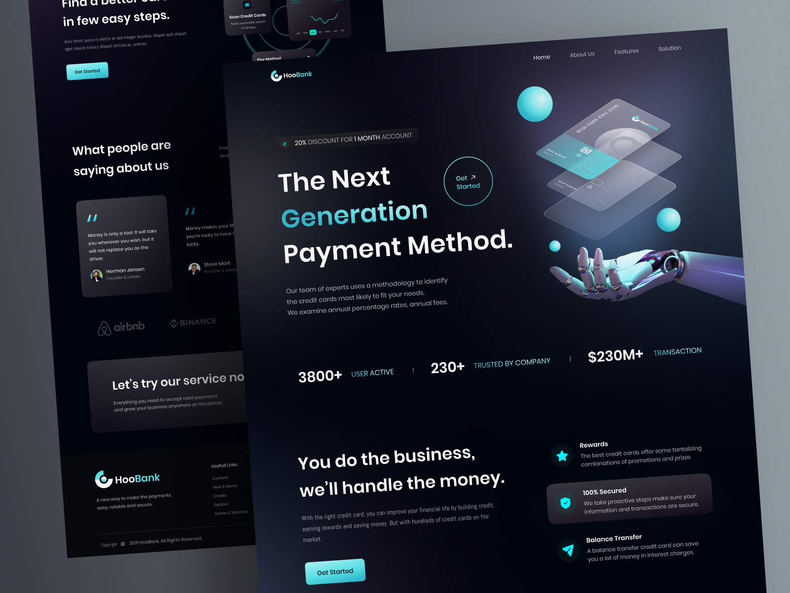

# Modern bank web

This project consisted of developing a responsive React JS application, by implementing a stunning hero section, high-quality assets and gradients, business stats, reusable features sections with call-to-actions buttons, testimonials and more.

The main objective in this project was to apply functional components that can be reusable, gain a better file and folder structure management, as well as experience with Tailwind.

Used technologies:

- React + JavaScript.
- Tailwind.
- CSS.
